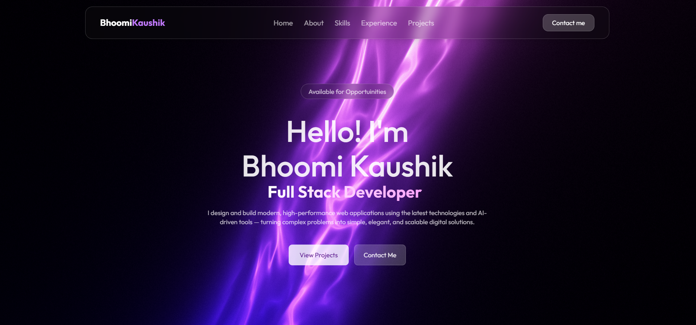

<div align="center">

<!-- Animated typing header -->
<a href="https://git.io/typing-svg">
  
</a>

### 🚀 My Portfolio

A modern, responsive personal portfolio website built to showcase my projects, skills, and experience.

<!-- Dynamic badges -->
[](https://your-live-link.com)


</div>

---

## 📸 Preview

<!-- Add a screenshot or GIF of your site here -->
<!--  -->



---

## ✨ Features

- 🎨 Modern, gradient-based UI with smooth hover animations
- 📱 Fully responsive — optimized for mobile, tablet, and desktop
- 🍔 Mobile-friendly navigation menu that auto-closes on link click
- ⚡ Smooth scroll navigation between sections
- 🧩 Modular, reusable React components
- 💡 Clean and readable codebase

---

## 🛠️ Built With

<div align="left">


</div>

---

## 📂 Project Structure

```
portfolio/
├── public/
├── src/
│   ├── assets/          # Images, icons, etc.
│   ├── components/      # Reusable components (Navbar, Footer, etc.)
│   ├── pages/            # Page-level components (Home, Projects, Contact)
│   ├── App.jsx
│   ├── main.jsx
│   └── index.css
├── package.json
└── README.md
```

---

## 🚦 Getting Started

### Prerequisites

Make sure you have the following installed:

- [Node.js](https://nodejs.org/) (v16 or higher)
- npm or yarn

### Installation

1. Clone the repository
   ```bash
   git clone https://github.com/your-username/portfolio.git
   ```

2. Navigate to the project directory
   ```bash
   cd portfolio
   ```

3. Install dependencies
   ```bash
   npm install
   ```

4. Start the development server
   ```bash
   npm run dev
   ```

5. Open [http://localhost:5173](http://localhost:5173) in your browser 🎉

---

## 📌 Sections

- **Home** – Introduction and quick call-to-action buttons
- **Projects** – A showcase of my featured work
- **About** – Skills, background, and experience
- **Contact** – Ways to get in touch with me

---

## 📬 Connect With Me

<div align="left">

[](https://your-live-link.com)
[](https://linkedin.com/in/yourprofile)
[](https://github.com/your-username)
[](mailto:your-email@example.com)

</div>

---

## 📊 GitHub Stats

<div align="left">


</div>

---

## 📄 License

This project is open source and available under the [MIT License](LICENSE).

---

<div align="center">

⭐ If you like this portfolio, feel free to give the repo a star!

</div>
